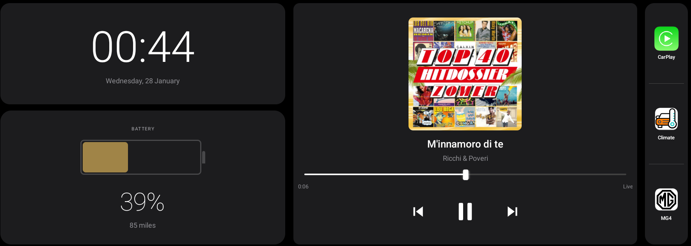

# Custom Launcher for MG4

A clean, modern Android launcher designed for the MG4 vehicle infotainment system.

[](docs/images/CustomLauncher.png)

## Disclaimer

I take no responsibility for any damage or voided warranty that may occur as the result of using this launcher. Use at your own risk.

The app is not affiliated with SAIC or the MG4 in any way.

## Notes

This app was 99% written by Claude AI, as I have no experience with Android development. I have only tested it on a Trophy MG4 running R67 of the FICM. You will need to grant the app permissions to access the device storage and Bluetooth for the media controls and album art to work.

I am sure there are better ways to do this, but this seems to do the job so far.

I would like to be able to replace the system sidebar at some point, but that will require more research and testing.

## Features

- **Battery & Range Display**: Shows real-time battery level and estimated range from SAIC vehicle service
- **Time & Date Widget**: Clean display of current time and date with auto-updates
- **Now Playing Card**: Displays current media playback information with album art and controls
- **Bluetooth Album Art**: Automatically loads album artwork from Bluetooth connected devices
- **App Shortcuts**: Quick access to installed applications
- **Debug Dialog**: Triple-tap the clock to view live logs (useful for on-car troubleshooting)
- **Clean Dark UI**: Modern Material Design with dark theme optimized for automotive use

## Key Components

### 1. Battery/Range Display

- Connects to SAIC SDK via reflection to get real-time battery data
- Uses `VehicleChargingManager.getCurrentElectricQuantity()` for battery percentage
- Uses `VehicleChargingManager.getCurrentEnduranceMileage()` for range in kilometers
- Color-coded battery card (green/yellow/red based on level)
- Click to open SAIC Charge Management Activity

### 2. Media Integration

- Uses Android MediaSession API to track playback
- Displays song title and artist
- Loads album artwork from Bluetooth storage (`/storage/emulated/0/bluetooth/[MAC]/AVRCP_BIP_IMG_*.JPEG`)
- Uses `ContentResolver` for secure file access
- Provides play/pause, previous, and next controls

### 3. Vehicle Service Integration

The launcher accesses SAIC SDK classes from the stock launcher APK using reflection:

```java
// Load SDK from launcher package context
Context launcherContext = context.createPackageContext(
    "com.saicmotor.hmi.launcher",
    Context.CONTEXT_INCLUDE_CODE
);

// Access VehicleChargingManager via reflection
Class<?> managerClass = launcherContext.getClassLoader().loadClass(
    "com.saicmotor.sdk.vehiclesettings.manager.VehicleChargingManager"
);

// Initialize with dynamic proxy listener (MUST NOT be null)
Proxy.newProxyInstance(
    launcherClassLoader,
    new Class<?>[] { listenerInterface },
    (proxy, method, args) -> { /* handle callbacks */ }
);
```

Key methods:

- `getCurrentElectricQuantity()` - Returns Float battery percentage
- `getCurrentEnduranceMileage()` - Returns Integer range in kilometers

## Installation

1. Build the APK using Android Studio or Gradle:

```bash
./gradlew assembleRelease
```

2. Install on the vehicle system:

```bash
adb install app/build/outputs/apk/release/app-release.apk
```

3. Set as default launcher:

- Go to Settings → Apps → Default Apps → Home app
- Select "Custom Launcher"

## Development Notes

### Vehicle Data Access ✅ WORKING

**No special permissions or system app installation required!**

The app accesses SAIC SDK classes by loading them from the stock launcher's package context:

- Uses `createPackageContext("com.saicmotor.hmi.launcher", CONTEXT_INCLUDE_CODE)`
- Regular user app installation works perfectly
- No platform certificate needed
- Tested and confirmed working on MG4 (28 Jan 2026)

**CRITICAL**: The SDK's `init()` method requires a non-null listener - use `Proxy.newProxyInstance()` to create a dynamic proxy.

### Bluetooth Album Art ✅ WORKING

Album art is loaded from Bluetooth storage:

- Path: `/storage/emulated/0/bluetooth/[MAC_ADDRESS]/AVRCP_BIP_IMG_*.JPEG`
- Requires `READ_EXTERNAL_STORAGE` and `WRITE_EXTERNAL_STORAGE` permissions
- Grant via: `adb shell pm grant com.custom.launcher android.permission.READ_EXTERNAL_STORAGE`
- Uses `ContentResolver.openInputStream()` for secure access
- Tested and confirmed working on MG4 (28 Jan 2026)

### Testing

For development without vehicle access:

- The VehicleDataService includes mock data fallback (39% battery, 136km range)
- Media controls work with any media app using MediaSession
- Emulator testing works for UI but not vehicle data

### Debug Dialog

Triple-tap the clock to open a live log viewer:

- View logs without ADB connection
- Auto-refreshes every second
- Filters for relevant logs (launcher, vehicle service, media service)
- Save logs to USB stick for offline analysis

### Customization

Edit these files to customize the UI:

- `res/layout/activity_main.xml` - Main layout
- `res/values/colors.xml` - Color scheme
- `MainActivity.java` - Logic and behavior

## Based on Analysis

This launcher is based on analysis of the SAIC launcher from firmware R67:

- Package: `com.saicmotor.hmi.launcher`
- Vehicle service bindings extracted from decompiled APK
- UI inspired by the original charging display

## Requirements

- Android 9 (API 28) or higher
- MG4 vehicle system with SAIC vehicle services
- Stock launcher (`com.saicmotor.hmi.launcher`) must be installed (provides SDK classes)
- Notification listener permission for media tracking
- Storage permissions for Bluetooth album art access

## Tested Configuration

- **Vehicle**: MG4 (Trophy)
- **Firmware**: R67 (1300 SWI68 R67)
- **Display**: 1778×720 @ 160 dpi
- **Test Date**: 28 January 2026
- **Status**: ✅ All features working (battery %, range, album art)

## License

For personal use only.
